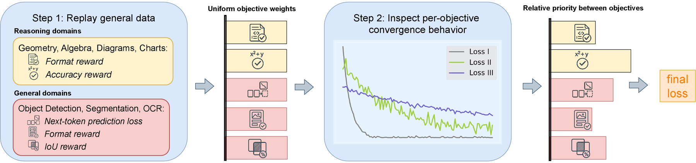
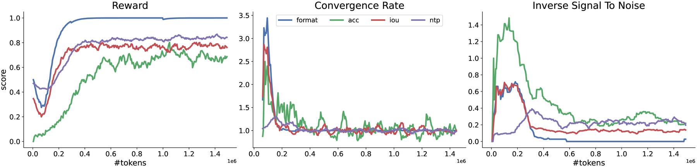

**Beyond Reasoning Gains: Mitigating General-Capability Forgetting in Large Reasoning Models**

Findings of the Association for Computational Linguistics: ACL 2026

[](https://aclanthology.org/2026.findings-acl.1717/)
[](https://arxiv.org/abs/2510.21978)

---

Reinforcement learning with verifiable rewards (RLVR) has delivered impressive gains in
mathematical and multimodal reasoning and has become a standard post-training paradigm for
contemporary language and vision-language models. However, the RLVR recipe introduces a
significant risk of capability regression, in which models forget foundational skills after
prolonged training without employing regularization strategies. While imposing regularization
terms like KL divergence can help prevent deviation from the base model, these terms are computed
on the current task and therefore do not guarantee preservation of broader knowledge. Meanwhile,
commonly used experience replay across heterogeneous domains makes it nontrivial to decide how
much training emphasis each objective should receive.

**RECAP** is a replay strategy with dynamic objective reweighting for general knowledge
preservation. It addresses forgetting in RLVR by (i) replaying general-capability data alongside
reasoning data, and (ii) dynamically reweighting objectives online using local estimates of
progress and instability for individual objectives, shifting the post-training focus away from
saturated objectives and toward underperforming or volatile ones. The method is end-to-end and
readily applicable to existing RLVR pipelines without training additional models or heavy tuning.



**Overview of RECAP.** Along with the target reasoning task, we sample data from general domains
to maintain that knowledge during finetuning. Initially, the objectives of interest are weighted
uniformly to optimize the main model. After a few iterations, we record the convergence behavior
of individual objectives. Based on this behavior, we adjust the focus to prevent any objective
from dominating and assign less weight to saturated ones.

## Results

### RLVR-only setting (Qwen2.5-VL-3B)

Accuracy on six benchmarks, where the MoDoMoDo baseline is trained to maximize performance. For
this table only, we use the rule-based evaluator on MathVista instead of `gpt-3.5-turbo`, to
align with MoDoMoDo.

| Model | SAT | ScienceQA | MathVista (mini) | ChartQA | InfoVQA | MMMU |
|---|---|---|---|---|---|---|
| *Open-source reasoning baselines* | | | | | | |
| VLAA-Thinker-3B | 49.38 | 14.63 | 30.4 | 45.84 | 30.81 | 32.22 |
| MM-R1-MGT-PerceReason | 50.83 | 34.21 | 33.4 | 44.88 | 61.42 | 40.22 |
| Ocean_R1_3B_Instruct | 59.49 | 68.72 | 38.7 | 54.00 | 38.02 | 40.89 |
| Qwen2.5VL-3b-RLCS | 24.12 | 21.32 | 17.2 | 3.32 | 10.86 | 27.11 |
| vision-grpo-qwen-2.5-vl-3b | 50.57 | 4.17 | 32.4 | 67.80 | 58.29 | 37.22 |
| Qwen2.5-VL-3B-Instruct-GRPO-deepmath | 34.70 | 45.27 | 32.3 | 70.24 | 49.75 | 39.11 |
| *Qwen2.5-VL-3B and our variants* | | | | | | |
| Base model | 43.98 | 6.20 | 23.6 | 43.88 | 32.02 | 38.67 |
| Uniform | 44.55 | 64.85 | 32.4 | 69.68 | 58.30 | 39.44 |
| MoDoMoDo | 49.95 | 65.74 | 32.2 | **70.40** | 59.88 | 39.11 |
| **RECAP** | **55.19** | **71.59** | **33.2** | **70.40** | **60.78** | **42.44** |

### Hybrid setting (Qwen2.5-VL-7B)

Accuracy (higher is better) on nine perception and reasoning benchmarks. The first block is
open-source reasoning models with different backbones; the second compares variants finetuned
from the same Qwen2.5-VL-7B base model. **Bold** = best, *italic* = second best within the
Qwen2.5-VL-7B family.

| Model | LISA | MMMU-PRO | AI2D | MathVista | MathVision | MathVerse | MMBench | VizWiz | OCRBench v2 |
|---|---|---|---|---|---|---|---|---|---|
| *Open-source reasoning baselines* | | | | | | | | | |
| VLAA-Thinker-7B | 63.14 | 26.30 | 75.45 | 63.90 | 11.18 | 29.87 | 75.95 | 47.57 | 40.23 |
| Vision-R1-7B | 47.30 | 26.76 | 0.00 | 61.80 | 18.75 | 23.32 | 69.46 | 53.12 | 24.63 |
| OpenVLThinker-7B | 42.73 | 21.79 | 59.94 | 59.10 | 5.59 | 19.26 | 71.53 | 52.89 | 28.30 |
| *Qwen2.5-VL-7B and our variants* | | | | | | | | | |
| Base model | 65.13 | 25.55 | 67.62 | 61.70 | 9.54 | 26.29 | 71.82 | 50.82 | 39.49 |
| LwF | 65.08 | 29.59 | 73.93 | 63.90 | 18.42 | 33.98 | 73.11 | 53.12 | *39.56* |
| PropMix | *66.80* | 31.39 | 75.32 | 63.40 | 21.05 | 34.75 | 73.54 | 57.05 | 37.60 |
| Uniform | 65.18 | 31.91 | 76.43 | 65.60 | 22.13 | 36.07 | 75.34 | 54.05 | 38.06 |
| Coreset | 64.82 | 31.91 | **79.92** | **66.90** | 23.36 | 37.58 | *78.09* | **63.76** | 35.49 |
| Reasoning-only | 57.58 | *33.87* | 74.97 | 65.50 | 24.87 | *40.74* | 77.84 | *62.45* | 38.55 |
| **RECAP** | **67.24** | **34.15** | *78.21* | *66.70* | **25.11** | **40.83** | **78.52** | 61.97 | **39.72** |


---

## Install

```bash
git clone https://github.com/VietHoang1512/recap.git && cd recap
python -m venv .venv && source .venv/bin/activate

pip install torch --index-url https://download.pytorch.org/whl/cu121   # match your CUDA
pip install -r requirements.txt
```

`flash-attn` sometimes needs `pip install flash-attn --no-build-isolation`.

## Data

```bash
export DATA_ROOT=/path/to/share_data

python scripts/prepare_data.py --list       # what is downloadable vs built locally
python scripts/prepare_data.py              # fetch the Hub-hosted datasets
```

Two replay sets are constructed rather than downloaded:

```bash
# LLaVA-OneVision OCR replay (concatenates the OCR configs, downsamples to 128px)
python scripts/data/build_ocr_replay.py

# RefCOCO grounding replay, from VLM-R1's rec_jsons_processed
python scripts/data/build_refcoco.py \
    --data-files rec_jsons_processed/refcoco{,p,g}_train.jsonl \
    --image-root $DATA_ROOT/RefCOCO --output-dir $DATA_ROOT/RefCOCO
```

## Train

```bash
OUTPUT_ROOT=/path/to/checkpoints python scripts/make_configs.py   # writes configs/generated/
bash scripts/train.sh configs/generated/rlvr_only/recap.yaml
```

`scripts/make_configs.py --list` shows the runs behind the paper's tables; each is
`configs/template.yaml` plus a small override set defined in that script.

### The knobs that matter

| key | paper | meaning |
|---|---|---|
| `normalize_loss: dwa` | — | enables RECAP reweighting (`none` = fixed weights) |
| `iteration_window` | `W` = 10 | sliding window; `2W` steps of history are kept |
| `softmax_temp` | `T` = 5.0 | higher flattens the weights; `T→0` lets one objective dominate |
| `convergence_instablity_tradeoff` | `α` = 0.5 | `s = α·convergence + (1−α)·instability`; `-1` anneals `α = 1 − step/max_steps` |
| `beta` | `β` = 0 | reference-KL coefficient; the LwF baseline uses 0.01 |

### Debugging

Per-objective weights, convergence rates and SNR are logged to W&B every step as
`convergence_rate/*`, `inverse_signal_to_noise/*` and `ema_loss/*`. For the raw trace, run at
`--log_level debug`. Per-sample reward traces are separate — set `DEBUG_MODE=true` and they go
to `$LOG_PATH`.



**Different rewards exhibit different convergence behavior.** While the `format` reward is easy
to optimize and initially has the highest convergence rate, it quickly saturates and thus yields
a near-unity convergence rate (*c* ~ 1) and low instability (*i* ~ 0) after 50 steps. By contrast,
the reasoning `accuracy` fluctuates the most, thereby steering the optimization toward the
corresponding objective. `IoU` and `ntp` denote the IoU reward and next-token-prediction accuracy
during training. The result is obtained in the first setting in our experiments.

## Evaluate

Benchmark numbers come from [LMMS-Eval](https://github.com/EvolvingLMMs-Lab/lmms-eval):

```bash
pip install lmms-eval
accelerate launch --num_processes 8 -m lmms_eval \
    --model qwen2_5_vl --model_args pretrained=<checkpoint> \
    --tasks mathvista_testmini,chartqa,infovqa,mmmu --batch_size 1
```

Two standalone evaluators are included:

```bash
# Referring-expression grounding (LISA, RefCOCO, Flickr): IoU accuracy
torchrun --nproc_per_node 8 scripts/eval_grounding.py \
    --model-path <checkpoint> --test-datasets lisa_test --num-samples -1

# KL(finetuned || base) on COCO captions -- how far the policy drifted
torchrun --nproc_per_node 8 scripts/eval_kl.py --model-path <checkpoint>
```

## Layout

```
src/open_r1/
├── mix.py                      entry point (python -m src.open_r1.mix)
├── configs.py                  all CLI/YAML arguments
├── loader.py                   dataset resolution + mixing
├── trainers/mixed_trainer.py   GRPO + SFT + RECAP reweighting
├── rewards/                    per-domain reward functions
└── dataset_utils/converter.py  per-dataset prompt/answer formatting
configs/                        template + generator output
scripts/                        data prep, training, evaluation
```

## Citation

```bibtex
@inproceedings{phan2026recap,
  title     = {Beyond Reasoning Gains: Mitigating General-Capability Forgetting
               in Large Reasoning Models},
  author    = {Phan, Hoang and Yang, Xianjun and Yao, Yuanshun and Zhang, Jingyu
               and Bi, Shengjie and Tang, Xiaocheng and Khabsa, Madian
               and Liu, Lijuan and Lei, Deren},
  booktitle = {Findings of the Association for Computational Linguistics: ACL 2026},
  publisher = {Association for Computational Linguistics},
  year      = {2026},
  url       = {https://aclanthology.org/2026.findings-acl.1717/}
}
```

## Acknowledgements

Built on [open-r1](https://github.com/huggingface/open-r1) (reward registry, GRPO scaffolding) by
way of [MoDoMoDo](https://github.com/lynl7130/MoDoMoDo), whose multi-domain RLVR setup the
RLVR-only experiments follow and whose static data mixture is the main baseline. The `open_r1`
package namespace is retained from that lineage. Evaluation uses
[LMMS-Eval](https://github.com/EvolvingLMMs-Lab/lmms-eval).
